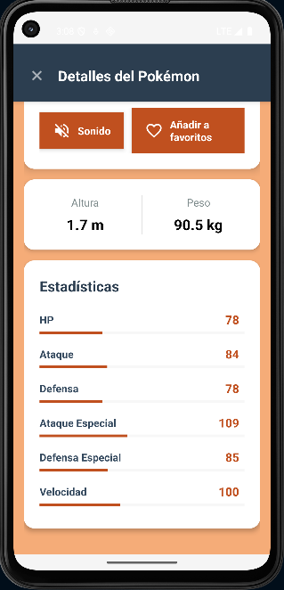

# 📱 Pokédex Android

<div align="center">
  
  
  
  
  
  
</div>

## 📖 Descripción

Aplicación Android nativa que consume la **PokéAPI** para mostrar información detallada de los primeros 151 Pokémon de la primera generación. Desarrollada con arquitectura **MVP (Model-View-Presenter)** y siguiendo las mejores prácticas de desarrollo Android.

## ✨ Características

### 🎯 Funcionalidades Principales
- **Exploración de Pokémon**: Visualiza los 151 Pokémon originales en una cuadrícula
- **Búsqueda en tiempo real**: Filtra Pokémon por nombre instantáneamente
- **Detalles completos**: Información detallada de cada Pokémon (tipos, stats, descripción, altura, peso)
- **Sistema de favoritos**: Guarda tus Pokémon favoritos localmente con Room Database
- **Interacción por audio**:
  - 🔊 **Pantalla principal**: Mantén presionado un Pokémon para escuchar su nombre con Text-to-Speech
  - 🎵 **Pantalla de detalles**: Doble toque en el botón de sonido para reproducir el grito del Pokémon
- **Colores dinámicos**: Interfaz adaptada al tipo de cada Pokémon

### 🎨 Interfaz de Usuario
- Diseño moderno y responsivo con Material Design
- Animaciones fluidas y transiciones suaves
- Soporte para modo claro
- Manejo de estados de carga y errores
- Feedback visual y auditivo en las interacciones

## 🏗️ Arquitectura

### Patrón MVP (Model-View-Presenter)
```
📦 com.example.pokedex
 ┣ 📂 activities         # Activities (Views)
 ┣ 📂 adapters          # RecyclerView Adapters
 ┣ 📂 database          # Room Database
 ┣ 📂 models            # Data Models
 ┣ 📂 network           # Retrofit API Service
 ┣ 📂 presenters        # Business Logic
 ┣ 📂 utils             # Utilidades (Colors, Cache, SoundPlayer)
 ┗ 📂 views             # View Interfaces
```

### Componentes Clave
- **Room Database**: Persistencia local de favoritos
- **Retrofit + Gson**: Consumo de API REST
- **Glide**: Carga eficiente de imágenes
- **MediaPlayer**: Reproducción de audio de Pokémon
- **TextToSpeech**: Síntesis de voz para nombres
- **RecyclerView**: Listas optimizadas

## 🛠️ Tecnologías y Librerías

| Tecnología | Versión | Propósito |
|------------|---------|-----------|
| Java | 8+ | Lenguaje principal |
| Android SDK | 24+ (Nougat) | Plataforma base |
| Retrofit | 2.9.0 | Cliente HTTP |
| Glide | 4.12.0 | Carga de imágenes |
| Room | 2.5.0 | Base de datos local |
| Material Design | 1.9.0 | Componentes UI |
| TextToSpeech | API 21+ | Síntesis de voz |
| MediaPlayer | API 21+ | Reproducción de audio |

## 📦 Instalación

### Requisitos Previos
- Android Studio Arctic Fox o superior
- JDK 8 o superior
- Dispositivo Android con API 24+ o emulador
- Conexión a Internet (para cargar datos y audio)

### Pasos de Instalación

1. **Clonar el repositorio**
```bash
git clone https://github.com/tu-usuario/pokedex-android.git
cd pokedex-android
```

2. **Abrir en Android Studio**
```
File > Open > Seleccionar carpeta del proyecto
```

3. **Sincronizar Gradle**
```
Android Studio sincronizará automáticamente las dependencias
```

4. **Ejecutar la aplicación**
```
Run > Run 'app' o presiona Shift + F10
```

## 🎮 Uso

### Pantalla Principal
- **Ver lista**: Desplázate para explorar todos los Pokémon
- **Buscar**: Escribe el nombre en el campo de búsqueda
- **Escuchar nombre**: Mantén presionado cualquier Pokémon para que la app pronuncie su nombre
- **Ver detalles**: Toca cualquier Pokémon para ver su información completa
- **Acceder a favoritos**: Toca el ícono de corazón en la esquina superior derecha

### Pantalla de Detalles
- **Estadísticas**: Visualiza HP, Ataque, Defensa, etc. con barras de progreso coloreadas
- **Reproducir grito**: Doble toque en el botón de volumen para escuchar el audio original
- **Favoritos**: Toca el botón de corazón para guardar/quitar de favoritos
- **Descripción**: Lee la información oficial de la Pokédex
- **Información física**: Altura y peso del Pokémon

### Pantalla de Favoritos
- **Gestión**: Accede desde el botón superior derecho de la pantalla principal
- **Persistencia**: Tus favoritos se guardan localmente con Room Database
- **Interacción**: Mismas funcionalidades que la pantalla principal (escuchar nombre, ver detalles)

## 🌐 API y Recursos Externos

### PokéAPI - The RESTful Pokémon API
- Base URL: `https://pokeapi.co/api/v2/`
- Endpoints utilizados:
  - `/pokemon?limit=151` - Lista de Pokémon de primera generación
  - `/pokemon/{id}` - Detalles del Pokémon (stats, tipos, medidas)
  - `/pokemon-species/{id}` - Descripción de la Pokédex

### Audio de Pokémon
- URL: `https://play.pokemonshowdown.com/audio/cries/{nombre}.mp3`
- Fuente: Pokémon Showdown
- Formato: MP3

### Text-to-Speech
- Motor: Android TextToSpeech API
- Idioma: Español (es_ES)
- Configuración: Velocidad 0.85x, Tono 1.0x

## 🎨 Características Técnicas

### Gestión de Audio
- **Clase `PokemonSoundPlayer`**: Manejo centralizado de reproducción de audio
- **Callbacks**: Notificación cuando termina la reproducción
- **Manejo de estados**: Pausa automática al cambiar de actividad
- **Liberación de recursos**: Limpieza apropiada en el ciclo de vida

### Sistema de Colores Dinámicos
- **18 tipos de Pokémon** con paletas de colores únicas
- Colores claros para fondos
- Colores oscuros para textos y acentos
- Caché de colores para optimizar rendimiento

### Optimizaciones
- **Caché de colores**: Reduce llamadas a la API
- **Glide**: Caché de imágenes en memoria y disco
- **RecyclerView**: Reutilización eficiente de vistas
- **Carga asíncrona**: Evita bloqueos del hilo principal

## 📸 Capturas de Pantalla

<div align="center">
  
  
  
</div>


## 🚀 Funcionalidades Futuras

- [ ] Soporte para modo oscuro
- [ ] Animaciones de entrada de Pokémon
- [ ] Filtros por tipo de Pokémon
- [ ] Comparador de estadísticas entre Pokémon
- [ ] Soporte para múltiples generaciones (Gen 2-9)
- [ ] Traducciones a múltiples idiomas
- [ ] Caché de imágenes offline completo
- [ ] Widget de Pokémon favorito en home screen
- [ ] Búsqueda por número de Pokédex
- [ ] Información de evoluciones

## 🤝 Contribuciones

Las contribuciones son bienvenidas. Para cambios importantes:

1. Fork el proyecto
2. Crea una rama para tu feature (`git checkout -b feature/AmazingFeature`)
3. Commit tus cambios (`git commit -m 'Add some AmazingFeature'`)
4. Push a la rama (`git push origin feature/AmazingFeature`)
5. Abre un Pull Request

## 📝 Licencia

Este proyecto está bajo la Licencia MIT - ver el archivo [LICENSE](LICENSE) para más detalles.

## 👨‍💻 Autor

Kenny Orlando Londoño Torrado
- GitHub: https://github.com/kennyLond
- LinkedIn: www.linkedin.com/in/kennylondono
- Email: kenny.londono.dev@gmail.com

## 🙏 Agradecimientos

- [PokéAPI](https://pokeapi.co/) por proporcionar los datos de Pokémon
- [Pokémon Showdown](https://play.pokemonshowdown.com/) por los archivos de audio
- La comunidad de Android Developers por sus recursos y guías


## 🔧 Troubleshooting

### El audio no se reproduce
- Verifica que el dispositivo tenga conexión a Internet
- Asegúrate de que el volumen multimedia esté activado
- Algunos Pokémon pueden no tener audio disponible

### Los colores no se cargan
- Verifica la conexión a Internet
- La app cargará colores por defecto hasta obtener el tipo del Pokémon

---

<div align="center">
  Hecho con ❤️ y ☕ por Kenny Londoño
  
  ⭐ ¡Dale una estrella si te gustó el proyecto!
  
  
</div>
